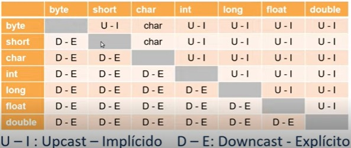

# Variáveis, Tipos de Dados e Operadores Matemáticos em JAVA

## VARIÁVEIS

### CONCEITUAÇÃO

*"Um espaço na memória do computador, onde se pode guardar valores."*

### TIPOS DE VARIÁVEIS (aula 1):

- instância: objeto;
- classe: classe;
- local: dentro de métodos;
- parâmetro: na assinatura do método.

#### Vamos falar aqui do tipo *local*:

Um ponto de partida para programas simples na linguagem JAVA é o método *main*. Que é 
um método que usamos para disparar a execução do nosso programa.

Será no método *main* que criaremos as variáveis iniciais.

### Padrão de Definição:

    <?visibilidade?> <?modificador?> tipo nome <?=valorInicial?>

    V (visibilidade): "public", "protected" e "private";
    M (modificador): "static" e "final";
    T (tipo): tipo de dado;
    N (nome): nome que é fornecido à variável;
    VI (valor inicial): um valor inicial, caso se deseje;

    nota: os valores entre <??> não são obrigatórios, os demais são:

Quando definimos em JAVA a variável *final*, significa que a variável é constante, ou seja,
o seu valor não será alterado durante a execução do programa.

Java é uma linguagem fortemente tipada, ou seja, você sempre tem que informar o tipo de
dado que será recebido pela variável.

### Convenções e regras na criação de variáveis:

- não devem começar com números;
- embora pemitido "$" e "_", devem ser evitados;
- são CaSe-sEnSiTIve;
- não devem ter espaços entre os caracteres;
- não podem ser usadas palavras reservadas do JAVA.

#### boas práticas:

- sempre começar com letras minúsculas;
- usar nomes expressivos, ou seja, que possam identificar bem a que se refere a variável;
- notacaoCamelo;
- quando constante(final), tudo maiúscula e separada por "_".

### TIPOS DE DADOS (aula 2):

### CONCEITUAÇÃO:

*"São os valores e consequentemente operações que as variáveis
podem assumir e sofrer, respectivamente"*

### Tipificação:

##### Estática(forte) vs Dinâmica(fraco):
  - Estática, quando uma linguagem obriga a definição do tipo;
  - Dinâmica, não há essa obrigação.
    
  Obs.: há uma relação entre as linguagens interpretadas vs compiladas e a tipagem. 

##### Primitivo vs Composto.
  - Primitivo, são atômitos(indivisíveis) e homogêneos. São valores numéricos, textuais,
sendo os valores mais básicos que uma variável pode ter.
  - Composto, não serão abordados aqui. É um dado heterogêneo, podendo
ser composto de várias coisas, como varios tipos de dados primitivos, e 
até mesmo ser composto de outros tipos compostos.

  Obs.: Os tipos atômicos são livres de raças de dados e podem ser 
modificados e/ou acessados por duas threads diferentes.
Um dado atômico é muito utilizado quando, por exemplo,
temos 2 ações distintas que são executadas nesse dado,
como leitura e gravação, esse tipo de dado também é muito
utilizado em sistemas operacionais, onde é necessário que um
dado seja acessado por threads distintas.

#### Opções de Tipos e exemplos:

- textual:
  - char: caracteres de 16 bits unicode -> char c = '\u0084; ou char c = 'T';
  - String: um tipo "especial" -> String s = "T";

Obs.1: sempres que trabalharmos com caracteres (char) de forma isolada devemos usar as aspas simples.

Obs.2: (String), embora seja uma classe, um tipo de dado composto, ele acabou se "primitivando", devido a uma necessidade de utilização de tipos de dados textuais. E neste caso as aspas são duplas.
- numeral: inteiros ou reais (a depender da quantidade de bits maior ou menor a capacidade de armazenamento):
  - byte: - 128 até 127 -> byte b = 15;
  - short: -32.768 até 32.767 -> short s = -15785;
  - int: (inteiros de 32 bits) -2.147.483.648 até 2.147.483.647 -> int i = 8515785
  - long: (inteiros de 64 bits) -9.223.372.036.854.755.807 -> long l = 5938515785L;
  - float: (fracionados de 32 bits) +-3.40282347E+38F -> double d = 3.14... (f);
  - double: (fracionados de 64 bits) +-1.79769313486231570E+308 -> double d = 3.14... (d).

Obs.: em JAVA (f) no final do valor de float é obrigatório, no final de double, opcional.
- lógico: (Verdadeiro ou Falso)
  - boolean: true or false -> coolean s = false;
- objeto: não serão abordados aqui.

### UTILIZAÇÃO:

#### Valor default:

Para cada tipo de dados há um valor padrão, ou seja, se não definirmos um valor para o tipo de dado, ele assumirá o valor padrão.

    byte = 0;
    short = 0;
    int = 0;
    long = 0L;
    float = 0.0f;
    double = 0.0d;
    char = '/u0000'
    String(e objetos) = null;
    boolean = false;

#### Boas Práticas:

Usar os tipos de dados adequados às necessidades.

### OPERADORES ARITMÉTICOS (aula 3)

### CONCEITUAÇÃO:

*"São símbolos especias capazes de realizar ações
específicas em um, dois ou mais operandos e, em 
seguida, retornar um resultado."*

#### Tipos:

exp = expressão

    posfixado: exp++ ou exp-- (soma ou subtrai uma unidade após usar a expressão.);
    prefixado: ++exp ou --exp (soma ou subtrai uma unidade antes usar a expressão.);
    aritmético: +, -, *, / e %(resto da divisão, chamado de mod);
    atribuição: =, +=, -=, *=, /= e %=;

Exemplos:

-> = significa que

    int i = ++k; -> i = k + 1;
    int j = k--; -> j = k; então k = k-1;
    float f = 1.5f + 4.5f;
    long l = 10398L * 5L;
    double d = 45d / 4d;
    int k = 15 % 4;
    double d = f;
    i += 5; -> i = i + 5;
    j -= 3; -> j = j - 3;
    d /= 2.7d; -> d = d / 2.7d;
    l *= 3; -> l = l * 3;
    k %= 2; -> k = k % 2;

#### Precedência

Diz respeito ao que será executado primeiro, no JAVA a ordem é:

    posfixado: exp++ ou exp--
    prefixado: ++exp ou --exp
    multiplicativo: *, /, %;
    aditivo: +, -;
    atribuitivo: =, +=, -=, *=, /=, %=;

  Obs.: também há uma precedência dentro de cada tipo operador acima;

    operadores: 1º, 2º, 3º...

### CONVERSÕES (casting) (aula 4)

### CONCEITUAÇÃO:

*"É a transformação de uma determinada variável de tipo menos específico
para um tipo mais específico ou vice-versa"*

Promover ou, rebaixar variáveis para um tipo com maior ou menor
capacidade de representação e armazenamento.

#### Tipos de Casting:

- Upcast (implícito);
  - na promoção de uma variável não é preciso informar o tipo(implícito) da promoção, pois como será maior, teoricamente, não haverá problemas.
- Downcast (explícito).
  - no rebaixamento de uma variável, eu obrigatóriamente tenho que informar o tipo do rebaixamento, 
para que a linguagem possa entenda o que será feito e lide com a perda de dados.

Os casting's podem ser feitos em tipos primitivos e compostos (objetos...), e como
o curso é sobre tipos primitivos. Não será abordado aqui os casos compostos.

Veja a tabela:

#### Exemplos:

    long l; int i = 10; l = i; promoção
    int i; long l = 100; i = (int) l; rebaixamento
    double d; float f = 10.5f; d = f; promoção
    float f; double d = 10.5d; f = (float) d; rebaixamento
    int i; float f = 10.5f; i = (int) f; // CUIDADO!!! HAVERÁ PERDA DE INFORMAÇÃO, ESTOU TRUNCANDO, OU SEJA, ELIMINANDO A PARTE DECIMAL.

# Links Úteis:

[Palavras Reservadas do Java e a sua Definição](https://www.codificante.com.br/voce-conhece-todas-as-palavras-reservadas-do-java)

